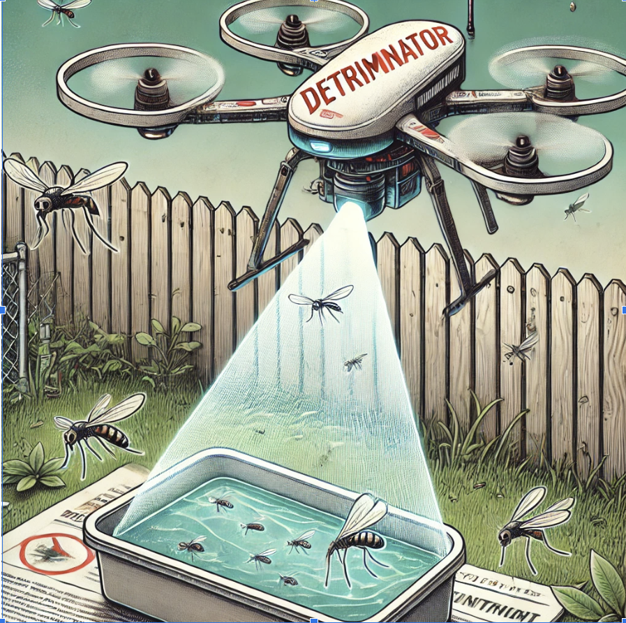
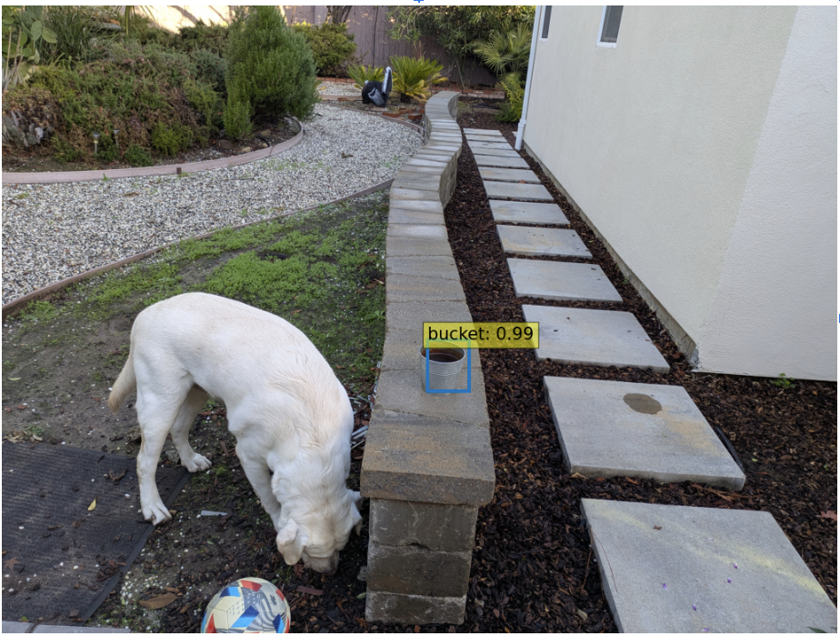

# `DETRiminator: Using AI to Prevent the Spreading of Mosquito-borne Diseases`

**`Katherine Zeng, katherinezhwc@gmail.com`**  

`Being portrayed as a tiny flying nuisance by most, mosquitoes are in reality the deadliest animal to humans in the world, killing around 1 million people every year. According to the Centers for Disease Control and Prevention(CDC), one of the most effective ways to protect against this danger is to look towards the root cause: water-holding containers left outside that mosquitos require in order to lay eggs and reproduce.` 

`In this project we trained an AI model to detect open water containers in the backyard of homes, which is one of the commonly overlooked breeding grounds for mosquitos. The training and evaluation dataset were created with images taken from a DJI Mini 4K drone. The images were then processed with the CVAT image annotation platform and exported to a format compatible with the COCO dataset. Our end-to-end object detection AI model is based on the state-of-the-art DETR model from Meta Research. We leveraged the pre-trained model from the HuggingFace Transformer library, then re-trained it with our own dataset using Pytorch Lighting on a Nvidia GeForce RTX 4060 GPU. The re-trained model was uploaded to HuggingFace model hub and can be downloaded later for inference.`

Complete **[PDF Paper](https://github.com/katherinezhwc/Detriminator/blob/master/Detriminator.pdf)**

